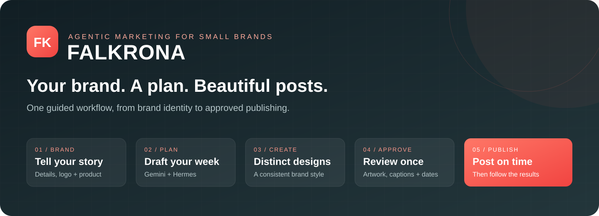
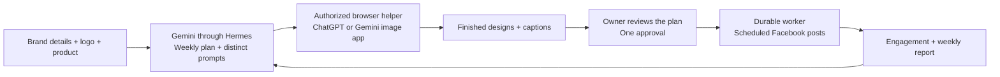

# Falkrona · Your Brand’s Pilot

<p align="center">
  
</p>

<p align="center">
  <strong>An agentic marketing assistant for small business owners.</strong><br />
  Turn your brand identity and product photos into a week of distinct, consistent designs — then approve once to schedule Facebook posts.
</p>

<p align="center">
  <a href="#what-falkrona-does">Features</a> ·
  <a href="#how-it-works">How it works</a> ·
  <a href="docs/SETUP.md">Complete setup</a> ·
  <a href="docs/HACKATHON_LOCAL_SETUP.md">For judges</a> ·
  <a href="docs/SETUP.md#troubleshooting">Troubleshooting</a>
</p>

<p align="center">
  
  
  
  
  
</p>

---

## Why Falkrona?

Running a small brand already means handling products, customers, and sales. Falkrona brings the weekly content workflow into one place: explain your brand, upload your own assets, draft a plan, review the finished work, and approve the schedule. The interface is built for brand owners who are neither engineers nor graphic designers.

Originally named **BrandPilot**, the project now uses **Falkrona**. Some internal package names, database names, and `BRANDPILOT_*` environment variables retain the original name for compatibility.

## What Falkrona does

| Capability | The owner experience |
| --- | --- |
| **Brand onboarding** | A short brand survey, required transparent logo, and optional design reference. |
| **Organized assets** | Product photos, logos, design references, and generated artwork have distinct roles. |
| **Weekly planning** | Gemini drafts a plan from confirmed brand context, the campaign goal, and selected language. |
| **Complete ad generation** | Gemini writes a detailed prompt for each post; the browser helper asks the selected image app to generate the artwork. |
| **Consistency with variety** | Shared palette, typography, logo treatment, and CTA style/position; different concepts and compositions across posts. |
| **Simple controls** | Arabic or English designs, delete an unwanted post/plan, regenerate a design with another idea, and change its posting date. |
| **One plan approval** | Review designs, captions, and Cairo posting times, then approve the whole plan to schedule Facebook delivery. |
| **Weekly results** | Engagement collection and weekly reports help inform the next plan when the connected platform grants access. |

### Current scope

| Integration | Status |
| --- | --- |
| Gemini API planning through pinned Hermes | Implemented and exercised in the live owner flow. |
| ChatGPT website image generation | Exercised with automatic attachment, submission, and image return; helper **0.1.5**. |
| Gemini website image generation | Adapter included; end-to-end account verification remains pending. |
| Facebook Page connection and scheduled publishing | Implemented; the owner reports successful publication testing. Requires the configured Meta app, granted permissions, and running workers. |
| Instagram | Deferred. The UI keeps it separate and unavailable for publishing until verified. |
| Local image renderer | Legacy/offline components remain in the repository; the live design workflow uses the image app. |

This is a development preview. Browser image generation depends on a signed-in browser and the image service’s current controls and account limits. See [the browser integration details](docs/BROWSER_IMAGE_WORKFLOW.md) and [recent validation evidence](docs/evidence/drafting-recovery-2026-10-03.md).

## How it works



Falkrona combines model reasoning with durable application state. Hermes runs the constrained Gemini planning turns; Falkrona supplies scoped brand context, validates structured output, stores jobs and artifacts, and manages retries and approval boundaries. The browser helper performs the authorized image-app actions. The delivery worker handles approved Facebook posts separately from model work.

A product photo supplies **product identity**, such as the bottle, packaging, and label. Its original background, props, and composition are explicitly discarded. Only the optional reference supplies style inspiration. Generating designs does not authorize publication.

## Start here

**The supported walkthrough is Windows + PowerShell.** The guide covers fresh dependency installation, secrets, database migrations, Hermes, owner setup, the browser helper, Meta, startup/shutdown, and recovery. macOS/Linux wrappers and a complete application Docker image are not included; the existing Compose file runs PostgreSQL only.

| You want to… | Follow this guide |
| --- | --- |
| Run Falkrona for the first time | [Complete setup, steps 1–7](docs/SETUP.md#1-prerequisites) |
| Try real planning and designs | [Gemini](docs/SETUP.md#4-enable-gemini-planning), then [browser helper](docs/SETUP.md#8-connect-the-browser-helper) |
| Connect Facebook and publish | [Meta setup, step 10](docs/SETUP.md#10-facebook-and-meta-setup) |
| Review the hackathon project | [Judge walkthrough](docs/HACKATHON_LOCAL_SETUP.md) |
| Fix a setup or generation issue | [Troubleshooting](docs/SETUP.md#troubleshooting) |

> A fresh installation downloads application dependencies and a separate pinned Hermes runtime. It also needs provider/account setup. A five-minute installation on an unprepared computer is not guaranteed. No hosted demo or developer laptop is required for a local run.

### First-time local preparation

After installing [Git](https://git-scm.com/downloads), [Node 24](https://nodejs.org/en/download), [uv](https://docs.astral.sh/uv/getting-started/installation/), and [Docker Desktop](https://docs.docker.com/desktop/setup/install/windows-install/), open PowerShell:

```powershell
git clone https://github.com/dark0danger/Falkrona.git
cd Falkrona
uv python install 3.13
uv sync --locked --python 3.13
npm ci
.\.venv\Scripts\python.exe scripts/local_setup.py init
docker compose -f infra/postgres/compose.yaml up -d --wait postgres
powershell -ExecutionPolicy Bypass -File scripts/migrate.ps1
```

The setup utility creates `.env` with unique security values and cookies configured for local HTTP. It refuses to replace an existing file. The initial mode is `offline_test`, with external model calls and publishing disabled.

For the actual Gemini workflow, set the following values in your local `.env`. Replace the placeholders with your own key and a supported model ID. Get a key from [Google AI Studio](https://aistudio.google.com/apikey), check [model availability](https://ai.google.dev/gemini-api/docs/models) and [pricing/free-tier eligibility](https://ai.google.dev/gemini-api/docs/pricing), then prepare Hermes:

```dotenv
BRANDPILOT_EXECUTION_MODE=gemini_free
BRANDPILOT_MODEL_PROVIDER=gemini
BRANDPILOT_GEMINI_MODEL=YOUR_SUPPORTED_GEMINI_MODEL_ID
GEMINI_API_KEY=YOUR_GEMINI_API_KEY
BRANDPILOT_OPENAI_PAID_ENABLED=false
BRANDPILOT_IMAGE_API_ENABLED=false
```

```powershell
powershell -ExecutionPolicy Bypass -File scripts/prepare_hermes.ps1
.\.venv\Scripts\python.exe scripts/local_setup.py hermes
```

`gemini_free` selects Falkrona’s free-mode policy; it cannot guarantee that your Google project is unbilled. Use an eligible free-tier project/model and public brand information. A ChatGPT or Gemini website subscription does not supply a Gemini API key. An OpenAI API key is not needed for the browser-based ChatGPT image path.

### Start and create your account

Run the API and frontend in **separate PowerShell terminals**, both from the repository root:

```powershell
# Terminal 1 — API
powershell -ExecutionPolicy Bypass -File scripts/run_api.ps1
```

```powershell
# Terminal 2 — frontend
npm run dev --workspace @falkrona/web
```

Open [Falkrona locally](http://127.0.0.1:5173). Expand **First-time workspace setup**, choose **Set up the owner**, enter your account details and workspace name, and use `BRANDPILOT_OWNER_SETUP_TOKEN` from your own `.env` as the local setup token. After account creation:

```powershell
# Terminal 3 — select the new workspace, then start its worker
.\.venv\Scripts\python.exe scripts/local_setup.py workspace
powershell -ExecutionPolicy Bypass -File scripts/run_worker.ps1
```

The workspace utility selects the sole workspace in a fresh database; it refuses to guess if several exist. For scheduled publishing, also run a dedicated delivery worker in a fourth terminal:

```powershell
powershell -ExecutionPolicy Bypass -File scripts/run_worker.ps1 --publishing-only
```

Next, [install and connect the browser helper](docs/SETUP.md#8-connect-the-browser-helper). Complete Branding, upload a product photo, and draft a plan. Add [Facebook publishing access](docs/SETUP.md#10-facebook-and-meta-setup) when ready to test delivery.

## The owner workflow

1. **Branding:** answer the short survey, upload a transparent logo, optionally add a design reference, and save.
2. **Products:** upload product identity photos and enter truthful product details.
3. **Content plan:** choose a future week, product photo, Arabic or English, and consent to sharing the brand inputs. Click **Draft a plan**.
4. **Generate:** the live draft flow prepares the Gemini plan and prompts, then runs the connected image app. Finished posts appear in the plan. Saved interrupted runs offer **Continue creating designs**.
5. **Review:** inspect the artwork and captions. Regenerate, delete, or change future posting times before approval.
6. **Approve plan & schedule:** approve the whole plan for the selected Facebook Page. Workers publish the approved posts at their Cairo times.
7. **Results:** inspect collected engagement and weekly reports; unavailable permissions or data must not be treated as real measured results.

Keep the image-app browser open during generation. Keep the API and workers running while scheduled jobs need to execute. A local run executes on the judge’s computer; it does not rely on the submitter’s laptop.

## Architecture

| Component | Responsibility |
| --- | --- |
| `apps/web` | React 19 + TypeScript owner interface; Vite proxies `/api` and `/health`. |
| `apps/api` | FastAPI authentication, workspace authorization, assets, plans, image handoff, and scheduling APIs. |
| `apps/worker` | Restartable workspace-scoped job execution, planning, engagement, reports, and publishing. |
| `packages/brandpilot_core` | Domain services, provider policy, durable jobs, storage, and PostgreSQL row-level security. |
| `packages/hermes_plugin` | Falkrona tool contracts for the pinned Hermes integration and offline probes. |
| `apps/browser-helper` | Chrome/Edge Manifest V3 extension for the authorized image-app handoff. |
| `infra/hermes` | Pinned runtime metadata and the social-media graphic-design skill. |
| `migrations` | Alembic database migrations. |

The application uses Python **3.13**, Node **24** / npm **11**, and PostgreSQL **17**. Hermes has its own separately managed runtime; do not install it into Falkrona’s `.venv`. Its exact source revision is recorded in [`infra/hermes/pin.json`](infra/hermes/pin.json).

## Validation

Recent stored evidence records backend, UI, helper, and PostgreSQL checks, along with successful Arabic image-generation recovery. Those are historical results, not an automatically updated CI badge. See [3 October generation evidence](docs/evidence/drafting-recovery-2026-10-03.md), [design controls](docs/evidence/owner-design-controls-2026-10-03.md), [posting-date editing](docs/evidence/posting-date-editor-2026-10-03.md), and [scheduled publishing checks](docs/evidence/scheduled-publishing-2026-10-02.md).

```powershell
# Offline phase checks use a separate *_phase_gate PostgreSQL database
.\.venv\Scripts\python.exe scripts/phase_gate.py --phase 11 --offline

# Frontend tests and build
npm test
npm run build

# Browser helper tests
node --test apps/browser-helper/background.test.cjs apps/browser-helper/provider.test.cjs apps/browser-helper/provider-dom.test.cjs
```

The optional [Hermes fixture probe](docs/SETUP.md#verification-and-development) exercises the real pinned agent loop without external model calls. Live Meta writes are separate from offline testing and require explicit plan approval.

## Documentation

| Guide | Contents |
| --- | --- |
| [Complete setup](docs/SETUP.md) | Install everything, configure accounts, run services, connect Meta, and troubleshoot. |
| [Judge walkthrough](docs/HACKATHON_LOCAL_SETUP.md) | A focused path through the project and what to demonstrate. |
| [Gemini planning](docs/GEMINI_CREATIVE_SETUP.md) | Provider configuration, asset roles, and planning boundaries. |
| [Browser image workflow](docs/BROWSER_IMAGE_WORKFLOW.md) | Consent, handoff, image import, adapter limits, and recovery. |
| [Browser helper](apps/browser-helper/README.md) | Installation, updating, connection, and account handling. |
| [Social checklist](docs/SOCIAL_APP_CHECKLIST.md) | Facebook permission and callback details; Instagram scope. |
| [Security operations](docs/SECURITY.md) | Secrets, credential encryption, rotation, and recovery. |
| [Project decisions](docs/DECISIONS.md) | Runtime, provider, state, and isolation decisions. |
| [Progress](docs/PROGRESS.md) | Phase-by-phase implementation and verification records. |
| [Dependency licenses](docs/DEPENDENCY_LICENSES.md) | Third-party package metadata. |

## License

Falkrona currently declares a **proprietary** license in `pyproject.toml`. Public source visibility does not grant an open-source license. Hermes and other dependencies retain their respective licenses; see the [dependency inventory](docs/DEPENDENCY_LICENSES.md).

---

<p align="center"><strong>Falkrona — Your Brand’s Pilot</strong><br /><sub>Built for small brands. Presented for the Agents at Work hackathon by Untap and wesam.ai.</sub></p>
